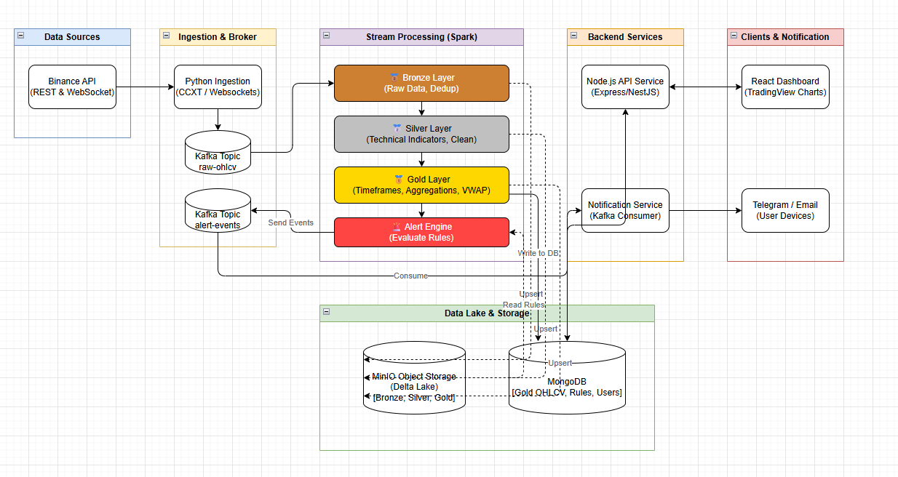

# Crypto Data Platform


Một pipeline dữ liệu thời gian thực và xử lý lô (batch) chuyên biệt để thu thập, xử lý và phân tích dữ liệu thị trường tiền mã hóa bằng Kafka, Spark Structured Streaming, Delta Lake, và MongoDB.

---

## 🎯 Bài toán (Problem)

Dữ liệu thị trường tiền mã hóa biến động cực mạnh và sinh ra liên tục. Các hệ thống lưu trữ truyền thống không thể xử lý hiệu quả việc thu thập, xử lý và phân tích thời gian thực ở quy mô lớn.

Dự án này xây dựng một nền tảng dữ liệu streaming mở rộng được để:
- Thu thập trực tiếp dữ liệu giá tiền mã hóa (ticks, OHLCV, orderbook) từ Binance qua WebSocket.
- Xử lý dữ liệu streaming trơn tru qua một pipeline thống nhất (Bronze -> Silver -> Gold).
- Tính toán trực tiếp các chỉ báo kỹ thuật và phát hiện tín hiệu giao dịch theo thời gian thực (on the fly).
- Lưu trữ dữ liệu có cấu trúc an toàn để phục vụ phân tích lịch sử cũng như trực quan hóa trên dashboard thời gian thực.

---

## 🏗 Kiến trúc hệ thống (Architecture)

Hệ thống tuân theo Kiến trúc Medallion hiện đại (Bronze -> Silver -> Gold) kết hợp với mô hình Streaming Lakehouse:

- **Nguồn dữ liệu (Data Source):** Binance API (WebSocket cho thời gian thực, REST cho đồng bộ dữ liệu quá khứ)
- **Tầng Streaming:** Apache Kafka (KRaft mode)
- **Tầng Xử lý (Processing Layer):** Apache Spark (Hợp nhất toàn bộ vào 1 Job PySpark Structured Streaming duy nhất)
- **Điều phối (Orchestration):** APScheduler (Giải pháp thay thế Airflow tối ưu và nhẹ nhàng hơn)
- **Lưu trữ (Storage):**
  - Tầng dữ liệu thô/đã xử lý/tổng hợp: MinIO (S3) + Delta Lake
  - Tầng phục vụ truy vấn (Serving layer): MongoDB
- **Microservices:** FastAPI (Hệ thống Alert Engine)
- **Trực quan hóa (Visualization):** Streamlit Dashboard

### Sơ đồ Kiến trúc (Architecture Diagram)



---

## 🔄 Luồng dữ liệu (Data Flow)

1. **Thu thập (Ingestion):** Crypto API sinh ra dữ liệu thị trường; Python producer phân tích cú pháp và serialize thành định dạng JSON.
2. **Đệm (Buffer):** Kafka tiếp nhận và lưu trữ luồng dữ liệu streaming qua nhiều partitions (ví dụ: `raw-ohlcv`).
3. **Xử lý (Processing):** Spark Streaming kéo dữ liệu theo từng micro-batches mỗi 30 giây.
4. **Tinh chỉnh (Refining):** 
   - *Bronze:* Lưu JSON thô thẳng vào bảng Delta.
   - *Silver:* Join với dữ liệu lịch sử (100 cây nến gần nhất) để tính toán các chỉ báo kỹ thuật (RSI, MA, MACD, Bollinger Bands).
   - *Gold:* Tổng hợp theo đa khung thời gian (5m, 15m, 1h) sử dụng lệnh `MERGE` (Upsert) của Delta Lake.
5. **Cảnh báo (Alerting):** Spark đối chiếu dữ liệu với bộ luật (rules) từ MongoDB và đẩy sự kiện cảnh báo ngược lại Kafka nếu có tín hiệu. Một consumer sẽ bắt lấy và gửi thông báo qua Telegram/Email.
6. **Phục vụ (Serving):** Streamlit truy vấn MongoDB để cập nhật giao diện Dashboard ngay tức thì.

---

## ⚙️ Tech Stack

- **Python 3.11+**
- **Apache Kafka** (Streaming Ingestion - KRaft mode)
- **Apache Spark** (Data Processing - PySpark Structured Streaming)
- **Delta Lake & MinIO** (Data Lakehouse Storage)
- **MongoDB** (Serving Database & Rule Engine Storage)
- **FastAPI** (Alerting API)
- **Streamlit** (Interactive Dashboard UI)
- **Docker & Docker Compose** (Containerization & Orchestration)

---

## 📁 Cấu trúc Dự án (Project Structure)

```text
crypto-analytics-platform/
│── ingestion/          # Các Producer Binance (WebSocket/REST) & APScheduler
│── spark/              # Các Job, Schema, UDFs của PySpark (Bronze -> Silver -> Gold)
│── alert_engine/       # Quản lý Rules bằng FastAPI, Kafka consumer & notifiers
│── dashboard/          # Giao diện Streamlit UI
│── docker/             # Các file Dockerfile cho toàn bộ microservices
│── k8s/                # Kubernetes manifests
│── scripts/            # Các script Setup, teardown, và testing
│── README.md
│── docker-compose.yml  # Stack để chạy local
```

---

## 🚀 Cách chạy dự án (How to Run)

### 1. Cấu hình môi trường
Clone repository về máy và chuẩn bị biến môi trường:
```bash
cp .env.example .env
# Chỉnh sửa file .env để điền API keys của Binance và Telegram Bot token
```

### 2. Khởi động các dịch vụ
Dự án có đi kèm script tự động hoàn toàn (setup docker, tạo topic Kafka, tạo dữ liệu mẫu):
```bash
bash scripts/setup.sh
```
*Hoặc bạn có thể tự chạy thủ công bằng lệnh `docker compose up -d --build`.*

### 3. Truy cập Nền tảng
- **Dashboard (Streamlit):** `http://localhost:8501`
- **Spark Master UI:** `http://localhost:8082`
- **MinIO Console:** `http://localhost:9001`
- **Alert Engine API:** `http://localhost:8000/docs`

---

## 📊 Tính năng nổi bật (Features)

- Thu thập dữ liệu tiền mã hóa thời gian thực (WebSocket) & Backfill hàng loạt quá khứ (REST).
- Xử lý luồng hợp nhất với Spark (Bronze -> Silver -> Gold trong 1 job duy nhất để tối ưu I/O).
- Tính toán chỉ báo kỹ thuật động (RSI, MA, MACD, BB, ATR) real-time.
- Tích hợp Delta Lake cùng khả năng Upsert mạnh mẽ (`MERGE`).
- Hệ thống Cảnh báo (Alert Engine) cực kỳ tùy biến (FastAPI + MongoDB) gửi báo động thẳng về Telegram/Email.
- Kiến trúc module hóa có thể scale cực tốt, sẵn sàng để deploy lên Kubernetes (k3s/Helm).

---

## 📈 Kết quả Đầu ra (Sample Output)

- **Metric Thời gian thực:** Giá, Khối lượng OHLCV và VWAP ở đa khung 1-phút, 5-phút, 1-giờ.
- **Tín hiệu Giao dịch:** Ví dụ "RSI < 30 VÀ đường MA7 cắt lên đường MA25 -> Tín hiệu MUA".
- **Phân tích:** Xu hướng Volume và tự động phân loại mô hình nến (Doji, Hammer...).

*(Bạn có thể chèn screenshot của Streamlit dashboard vào đây)*

---

## 🧠 Những gì tôi học được (What I Learned)

- Cách thiết kế và tối ưu một end-to-end Streaming Lakehouse pipeline dành cho môi trường giới hạn RAM (16GB).
- Cách triển khai Unified Spark Structured Streaming Job để giảm đáng kể độ trễ I/O.
- Xử lý Upsert dữ liệu chuỗi thời gian (time-series) bằng sức mạnh `MERGE` của Delta Lake.
- Xây dựng kiến trúc microservice phân tán sử dụng Kafka làm cầu nối tin nhắn giữa Spark và FastAPI.
- Điều phối hệ thống nhiều container (hơn 11 containers) bằng Docker Compose và tiến tới chuyển đổi lên Kubernetes.

---

## 🔮 Cải tiến trong Tương lai (Future Improvements)

- Triển khai toàn diện lên Cloud Infrastructure (AWS EKS hoặc GCP GKE).
- Tích hợp Apache Airflow để điều phối các tác vụ batch phức tạp song song với luồng streaming.
- Thêm kiểm định Chất lượng Dữ liệu nghiêm ngặt (Data Quality checks - ví dụ dùng Great Expectations).
- Mở rộng dashboard với Apache Superset hoặc Grafana để thực hiện các câu truy vấn OLAP sâu hơn.

---

## ⭐ Demo

- [Watch Demo Video](#)
- [Live Dashboard](#)
